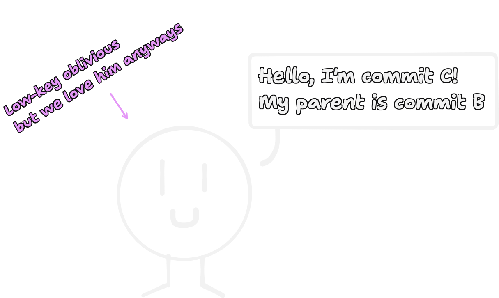
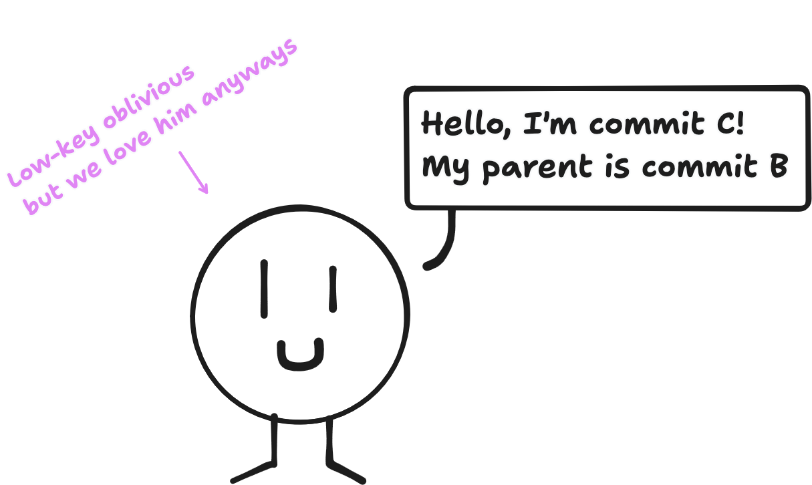
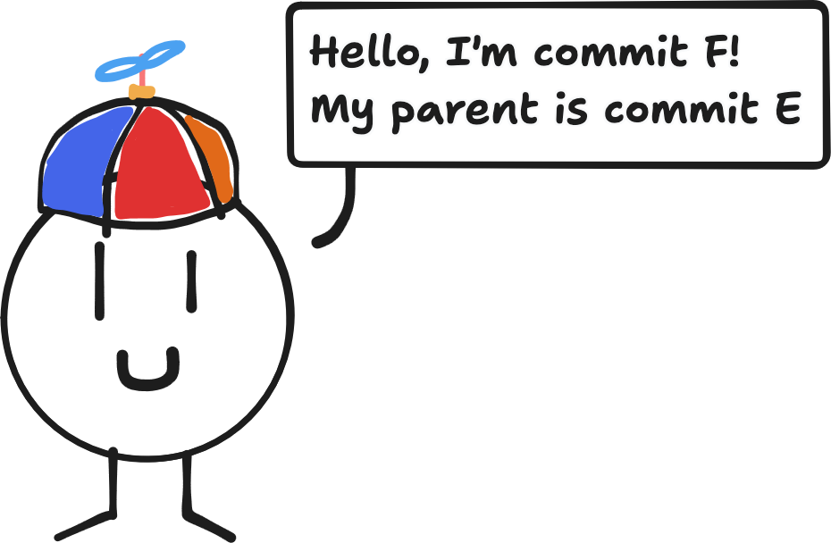

+++
title = "Updating Stacked Pull Requests with git rebase --onto"
description = "Going over an example rebasing a pull request stacked on another with git rebase --onto"

[taxonomies]
tags = ["git"]
+++

<style>
    body {
        img.dark-only {
            display: none;
        }

        img.light-only {
            display: inline;
        }
    }

    body.dark {
        img.dark-only {
            display: inline;
        }

        img.light-only {
            display: none;
        }
    }

    em {
        &.commit-a {
            color: var(--callout-warning-color);
        }

        &.commit-b {
            color: var(--callout-tip-color);
        }

        &.commit-c {
            color: var(--callout-important-color);
        }

        &.commit-e {
            color: var(--callout-note-color);
        }
    }
</style>

Sometimes I find myself in the situation where I have multiple pull requests that build off of each other.

{{ figure(src = "original.png", alt = "TODO") }}

Then, a reviewer asks me to squash <em class="commit-b">commit B</em> into <em class="commit-a">commit A</em>, creating a new <em class="commit-e">commit E</em>. I do so, but now my second pull request is all messed up!

{{ figure(src = "squashed.png", alt = "TODO") }}

When Git created <em class="commit-e">commit E</em>, it didn't tell <em class="commit-b">commit B</em>'s children that their new parent should be <em class="commit-e">commit E</em>. This means that <em class="commit-c">commit C</em> still thinks its parent is <em class="commit-b">commit B</em>!

<figure>
    
    
</figure>

While this behavior is a sensible default, in this scenario we don't want it. We can tell <em class="commit-c">commit C</em> that its new parent is <em class="commit-e">commit E</em> by rebasing it with the following command:

```sh
# Make sure we're on the second PR's branch.
git switch second-pr

# Tell commit C that its new parent is E, not B.
git rebase --onto E B
```

{{ figure(src = "rebased.png", alt = "TODO") }}

The general form of this command is `git rebase --onto <newparent> <oldparent>`, and it's very useful when updating stacked pull requests where the parent commit has been replaced. You don't need it if the base pull request only had new commits added, though, in which case you would use a normal `git rebase` without the `--onto` option. Once you do rebase your second pull request, take a look at the [`--force-with-lease`](https://git-scm.com/docs/git-push#Documentation/git-push.txt---force-with-lease) option of `git push` to safely push your changes to the remote.

<figure>
    
    
</figure>

_Thank you to [sEver on Stack Overflow for the answer](https://stackoverflow.com/a/39081674) that inspired this article!_
